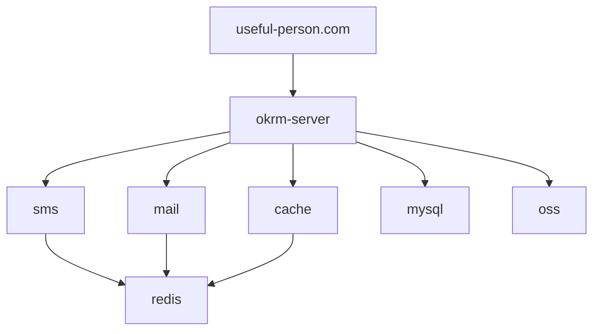

# OKRM

## Maven操作

### 清理 & 构建

```shell
mvn clean install
```

等价于

```shell
mvn clean
mvn validate
mvn compile
mvn test
mvn package
mvn verify
mvn install
```

### 单元测试

```shell
mvn test
```

### 跳过单元测试

```shell
mvn clean install -DskipTests
```

### 运行 user-service

```bash
cd user-service
java -jar myapp.jar --spring.profiles.active=prod

mvn spring-boot:run
mvn spring-boot:run -Dspring-boot.run.profiles=prod

```

如果是用 IDE（比如 IntelliJ IDEA），也可以在 Run/Debug Configurations → VM Options 里加：

```
-Dspring.profiles.active=test
```

user-service 就可以使用 common-utils 里的工具类了。

### `mvn clean install -Dversion=0.0.1-SNAPSHOT` 为什么没有覆盖 `pom.xml` 里的 `version`  

这是因为 Maven `-Dversion` 只是一个临时的 System Property，它不会修改 `pom.xml` 里的 `version`。  

## 为什么 `-Dversion` 不会覆盖 `pom.xml` 里的 `version`  

1. Maven 运行时 `-Dversion` 只是一个临时参数，不会修改 `pom.xml`  
2. Maven 不会自动更新 `pom.xml`，因为 `version` 是一个 POM 元数据  
3. Maven 只会使用 `-Dversion` 影响某些插件（如 `versions:set`），但不会影响 `install`  

## 如何正确修改 `version`  

### 方法 1：手动修改 `pom.xml`  

```xml
<version>0.0.1-SNAPSHOT</version>
```  

然后运行：  

```bash
mvn clean install
```  

### 使用 `versions:set` 插件  

如果想自动修改 `pom.xml` 的 `version`，需要使用 `maven-versions-plugin`：  

```bash
mvn versions:set -DnewVersion=0.0.1-SNAPSHOT
```  

然后提交修改：  

```bash
mvn versions:commit
```  

这会真正修改 `pom.xml` 里的 `version`，然后再运行：  

```bash
mvn clean install
```  

### 临时指定版本（不修改 `pom.xml`）  

如果只是想在一次构建中使用临时版本，而不修改 `pom.xml`：  

```bash
mvn clean install -Drevision=0.0.1-SNAPSHOT
```  

这个方法适用于 `pom.xml` 使用 `revision` 变量：  

```xml
<version>${revision}</version>
```  

这样 `-Drevision=0.0.1-SNAPSHOT` 就能生效。  

### 总结  

| 方法 | 是否修改 `pom.xml` | 是否影响 `install` |  
|---------|----------------|------------------|  
| `-Dversion=xxx` | ❌ 否 | ❌ 否 |  
| `versions:set` | ✅ 是 | ✅ 是 |  
| 直接改 `pom.xml` | ✅ 是 | ✅ 是 |  
| `-Drevision=xxx`（如果 `pom.xml` 使用 `revision` 变量） | ❌否 | ✅是 |  

如果想真正修改 `version`，推荐 `mvn versions:set -DnewVersion=xxx`。

cd user-service
mvn spring-boot:run

启用docker

```sh
# 是否启用docker
spring.docker.compose.enabled=true
```


## 使用说明

安装IDE，修改IDE编码格式为UTF-8

安装mysql 8.x

运行redis

安装docker

docker pull redis

docker run --name okrm-redis -d redis

或者直接下载redis

make

make test

make install

make test

./src/redis-server

新建mysql用户okrm并给它赋予权限

安装lombok

maven构建

maven构建

```shell
mvn clean install package -Dmaven.test.skip=true -Pprod
```


## 介绍

okrm-server基于spring全家桶开发。

## 软件架构




## 安装教程

### 数据库密码加密

```shell
# 加密
mvn jasypt:encrypt-value -Djasypt.encryptor.password="密钥（仅限ascii格式）" -Djasypt.plugin.value="密码明文"
# 可以直接在配置文件中配置DEC(123456)，使用DEC(密码明文)，执行下面的命令后，会将配置文件中的DEC(密码明文)替换成ENC(加密后的密码)
mvn jasypt:encrypt -Djasypt.plugin.path="file:useful-person.okrm-server/src/main/resources/application.yml" -Djasypt.encryptor.password="密钥"
# 解密
mvn jasypt:decrypt-value -Djasypt.encryptor.password="密钥" -Djasypt.plugin.value="密文"
```
也可以直接使用jar包进行加解密

```shell
java -cp jasypt-1.9.2.jar org.jasypt.intf.cli.JasyptPBEStringEncryptionCLI input="root" password=security algorithm=PBEWithMD5AndDES

java -cp jasypt-1.9.2.jar org.jasypt.intf.cli.JasyptPBEStringDecryptionCLI input="i00VogiiZ1FpZR9McY7XNw==" password=security algorithm=PBEWithMD5AndD
```


### MySQL

使用root用户使用utf8mb4字符集创建okrm库，创建用户名okrm密码okrm_password授权dba、数据库okrm，

使用okrm-core/src/main/resources/sql中的sql初始化持续登录的表和用户连接信息的表

### Redis

在项目根目录使用docker-compose启动redis

```shell
docker-compose up -d
docker-compose stop
docker-compose restart
docker-compose rm
```

### 服务器目录结构

```
# okrm-server
/home/okrm
/home/okrm/goaloneService.sh
/home/okrm/servicespace
/home/okrm/okrm-server
# useful-person.com
/home/okrm/www/useful-person.com
```

### nginx配置

```
location / {
    root /home/okrm/www/useful-person.com;
    index index.html index.htm;
}
location /api/ {
    proxy_pass http://127.0.0.1:8081/;
    # 获取客户端真实ip $host 变量，Host 为变量名
    proxy_set_header   Host             $host;
    proxy_set_header   X-Real-IP        $remote_addr;
    proxy_set_header   X-Forwarded-For  $proxy_add_x_forwarded_for;
}
```

### 证书配置
nginx配置目录`/root/nginx/conf`
将证书上传到目录`/root/nginx/conf/cert`
```shell
scp ~/Downloads/6079910_useful-person.com_nginx/6079910_useful-person.com.* root@121.40.244.200:/root/nginx/conf/cert/
```
修改对应的conf文件，将指定正确的证书地址
```shell
```
重启nginx
```shell
/root/nginx/nginx -s reload
```
访问浏览，刷新证书

### 如何为不同的密码使用不同的密钥：

可以为不同的敏感信息（如数据库密码、Redis 密码、MQ 密码）使用不同的密钥进行加密和解密。这可以通过 Jasypt 的配置来实现，为每个密码配置不同的密钥。


1. **配置多个加密器**：你可以在 Spring Boot 配置文件中设置多个 Jasypt 加密器，每个加密器使用不同的密钥。
   
2. **使用不同的配置文件或环境变量**：可以通过环境变量或者命令行参数来指定不同的密钥，确保每个敏感信息使用不同的加密密钥进行解密。

### 步骤 1：为不同的密码设置不同的加密密钥

首先，你需要为每个密码分别生成加密密钥，并进行加密。

例如，使用 Jasypt 加密工具为不同的密码生成加密后的值。

- **数据库密码加密**：
   ```bash
   mvn jasypt:encrypt -Djasypt.encryptor.password=dbSecretKey -Djasypt.plugin.value="databasePassword"
   ```

- **Redis 密码加密**：
   ```bash
   mvn jasypt:encrypt -Djasypt.encryptor.password=redisSecretKey -Djasypt.plugin.value="redisPassword"
   ```

- **MQ 密码加密**：
   ```bash
   mvn jasypt:encrypt -Djasypt.encryptor.password=mqSecretKey -Djasypt.plugin.value="mqPassword"
   ```

这样，你就得到了每个密码的加密值，类似于：

- `ENC(WDYgHWcc1tNPwrX5vHV/bLhMOjokAensnK9nUnUKup8UGsL41zjjbfTpBFHaaqBJ)`（数据库密码）
- `ENC(WDYgHWcc1tNPwrX5vHV/bLhMOjokAensnK9nUnUKup8UGsL41zjjbfTpBFHaaqBJ)`（Redis 密码）
- `ENC(WDYgHWcc1tNPwrX5vHV/bLhMOjokAensnK9nUnUKup8UGsL41zjjbfTpBFHaaqBJ)`（MQ 密码）

### 步骤 2：在配置文件中使用不同的密钥进行解密

在你的 Spring Boot 配置文件中，你可以为每个密码设置不同的解密密钥。这样，Spring Boot 会根据你指定的密钥分别解密各个密码。

```yaml
spring:
  datasource:
    url: jdbc:mysql://localhost:3306/mydb
    username: myuser
    password: ENC(WDYgHWcc1tNPwrX5vHV/bLhMOjokAensnK9nUnUKup8UGsL41zjjbfTpBFHaaqBJ) # 数据库密码加密

  redis:
    host: localhost
    port: 6379
    password: ENC(WDYgHWcc1tNPwrX5vHV/bLhMOjokAensnK9nUnUKup8UGsL41zjjbfTpBFHaaqBJ) # Redis 密码加密

  mq:
    host: localhost
    port: 5672
    username: mquser
    password: ENC(WDYgHWcc1tNPwrX5vHV/bLhMOjokAensnK9nUnUKup8UGsL41zjjbfTpBFHaaqBJ) # MQ 密码加密
```

### 步骤 3：在 `application.yml` 中配置多个密钥解密器

要使用不同的密钥解密这些密码，可以通过 `@Value` 注解或者 `Spring Boot` 的 `jasypt` 配置来实现。例如，你可以为每个加密的配置使用不同的解密密钥：

```yaml
jasypt:
  encryptor:
    password:
      db: dbSecretKey         # 数据库密钥
      redis: redisSecretKey   # Redis 密钥
      mq: mqSecretKey         # MQ 密钥
```

如果你想要在同一个应用中使用不同的密钥，你可以手动配置多个解密器：

```java
@Configuration
public class JasyptConfig {

    @Bean
    public StandardPBEStringEncryptor dbEncryptor() {
        StandardPBEStringEncryptor encryptor = new StandardPBEStringEncryptor();
        encryptor.setPassword("dbSecretKey"); // 数据库密码的密钥
        return encryptor;
    }

    @Bean
    public StandardPBEStringEncryptor redisEncryptor() {
        StandardPBEStringEncryptor encryptor = new StandardPBEStringEncryptor();
        encryptor.setPassword("redisSecretKey"); // Redis 密码的密钥
        return encryptor;
    }

    @Bean
    public StandardPBEStringEncryptor mqEncryptor() {
        StandardPBEStringEncryptor encryptor = new StandardPBEStringEncryptor();
        encryptor.setPassword("mqSecretKey"); // MQ 密码的密钥
        return encryptor;
    }
}
```

### 步骤 4：在应用启动时指定密钥

如果你在应用启动时使用不同的密钥来解密，你可以通过环境变量或命令行参数来指定每个密钥：

```bash
java -Djasypt.encryptor.password.db=dbSecretKey \
     -Djasypt.encryptor.password.redis=redisSecretKey \
     -Djasypt.encryptor.password.mq=mqSecretKey \
     -jar your-app.jar
```

这样，你的应用将使用不同的密钥来解密不同的密码。

### 总结：

1. **为每个敏感信息使用不同的密钥加密**：你可以使用 Jasypt 对数据库密码、Redis 密码、MQ 密码分别加密，并将它们放到配置文件中，使用 `ENC(...)` 格式存储。
   
2. **为每个密码使用不同的密钥解密**：通过配置文件或启动时的参数来指定不同的密钥解密不同的密码。

3. **Jasypt 配置**：你可以为每个敏感信息创建不同的解密器，并在 Spring Boot 配置文件中进行配置。

## docker 镜像地址

registry.cn-hangzhou.aliyuncs.com/useful-person/

docker compose --env-file .env.unix up
docker compose --env-file .env.window up

`.env` 文件**本身不能自动识别当前操作系统或环境来切换变量**，它只是一个静态的环境变量文件。但你可以用**一些变通方案**来实现 **“按平台选择不同配置”** 的效果：

---

## ✅ 推荐方案：**多个 `.env` 文件 + 启动时指定**

### 示例结构：

```
.
├── docker-compose.yml
├── .env.mac
├── .env.windows
├── .env.linux
```

### 示例内容（`.env.mac`）：

```env
MYSQL_PRIMARY_DATA_PATH=/Users/you/docker-data/mysql-primary
MYSQL_SECONDARY_DATA_PATH=/Users/you/docker-data/mysql-secondary
```

### 示例内容（`.env.windows`）：

```env
MYSQL_PRIMARY_DATA_PATH=/c/docker-data/mysql-primary
MYSQL_SECONDARY_DATA_PATH=/c/docker-data/mysql-secondary
```

---

### 启动方式（根据系统选用）：

```bash
# macOS
docker compose --env-file .env.mac up

# Windows（Git Bash）
docker compose --env-file .env.windows up

# Linux
docker compose --env-file .env.linux up
```

---

## ⚙️ 进阶方案：用脚本动态选择 `.env`

你可以写一个简单的启动脚本，根据操作系统自动加载对应 `.env` 文件。

### 示例：Bash 启动脚本 `start.sh`（适用于 macOS/Linux）

```bash
#!/bin/bash

case "$(uname -s)" in
   Darwin)
     ENV_FILE=".env.mac"
     ;;
   Linux)
     ENV_FILE=".env.linux"
     ;;
   *)
     echo "Unsupported OS"
     exit 1
     ;;
esac

docker compose --env-file $ENV_FILE up
```

### 示例：PowerShell 脚本 `start.ps1`（适用于 Windows）

```powershell
$envFile = ".env.windows"
docker compose --env-file $envFile up
```

---

### 总结：

| 方法               | 是否推荐  | 自动判断平台 | 跨平台友好 | 难度  |
| ---------------- | ----- | ------ | ----- | --- |
| 单 `.env` 文件      | ❌ 不推荐 | ❌      | ❌     | 低   |
| 多 `.env` 文件 + 指定 | ✅ 推荐  | ❌（手动选） | ✅     | 中   |
| 脚本自动判断平台         | ✅ 推荐  | ✅      | ✅     | 中-高 |

---

在使用 Docker 构建和部署 Spring 应用时，有多种方式可以“注入” Spring 配置，例如 `application.properties` 或 `application.yml` 文件、环境变量、命令行参数等。下面是几种常用的方式和如何在 `Dockerfile` 和运行容器时操作它们。

---

## ✅ 方法一：使用外部配置文件挂载

这是最推荐的方法，配置文件与镜像解耦，适合不同环境部署。

### Dockerfile 示例（无需特别处理配置）：

```Dockerfile
FROM openjdk:17-jdk-slim
COPY target/myapp.jar app.jar
ENTRYPOINT ["java", "-jar", "/app.jar"]
```

### 启动容器时挂载配置文件：

```bash
docker run -v /path/to/application.properties:/config/application.properties \
  -e SPRING_CONFIG_LOCATION=file:/config/application.properties \
  myapp
```

---

## ✅ 方法二：使用环境变量注入配置

Spring Boot 支持从环境变量中读取配置。

### Dockerfile 示例：

```Dockerfile
FROM openjdk:17-jdk-slim
COPY target/myapp.jar app.jar
ENTRYPOINT ["java", "-jar", "/app.jar"]
```

### 启动容器时注入环境变量：

```bash
docker run -e SPRING_DATASOURCE_URL=jdbc:mysql://db:3306/mydb \
  -e SPRING_DATASOURCE_USERNAME=root \
  -e SPRING_DATASOURCE_PASSWORD=secret \
  myapp
```

---

## ✅ 方法三：打包时直接包含配置（不推荐动态环境）

将配置文件直接 COPY 到镜像中。

### Dockerfile 示例：

```Dockerfile
FROM openjdk:17-jdk-slim
COPY target/myapp.jar app.jar
COPY config/application.properties /config/application.properties
ENTRYPOINT ["java", "-jar", "/app.jar", "--spring.config.location=file:/config/application.properties"]
```

---

## ✅ 方法四：使用命令行参数覆盖配置

```Dockerfile
ENTRYPOINT ["java", "-jar", "/app.jar"]
```

然后运行时：

```bash
docker run myapp --spring.profiles.active=prod --server.port=8085
```

---

## 小结：推荐实践

| 方法     | 适用场景               | 是否推荐       |
| ------ | ------------------ | ---------- |
| 配置挂载   | 可灵活调整部署配置          | ✅ 推荐       |
| 环境变量   | 适合 CI/CD 和 Secrets | ✅ 推荐       |
| 镜像内嵌配置 | 测试或固定配置场景          | ⚠️ 不推荐用于生产 |
| 命令行参数  | 小型调整（如 profile）    | ✅ 推荐       |

---

mvn clean install -DskipTests && docker compose --env-file .env.window down --volumes --remove-orphans && docker compose --env-file .env.window up --build -d
